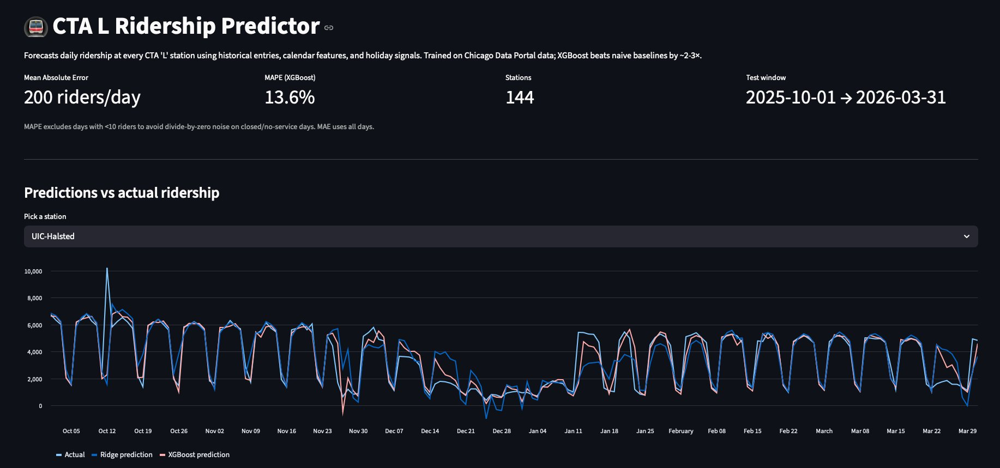
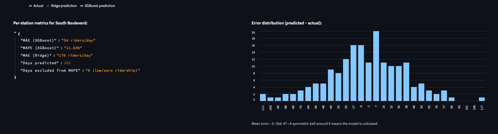
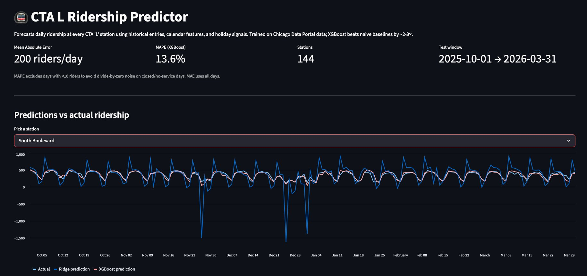
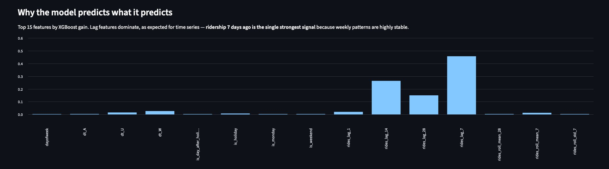

# CTA L Ridership Predictor 🚇

Daily ridership forecasts for every Chicago 'L' train station, built on 23+ years
of public transit data from the Chicago Data Portal.

**Stack:** Python • pandas • scikit-learn • XGBoost • Streamlit
**Validation:** walk-forward time-series cross-validation
**Result on test set:** **13.6% MAPE, R² = 0.94** with XGBoost — **2.3× better** than naive baselines



---

## What this is

A reproducible machine-learning pipeline that:

1. Pulls daily ridership totals for every CTA 'L' station from Chicago's public Data Portal (1.3 million rows)
2. Engineers time-aware features (calendar, holidays, lags, rolling statistics) **without temporal leakage**
3. Compares Ridge regression and XGBoost against two naive baselines
4. Validates with `TimeSeriesSplit` walk-forward cross-validation (NOT random k-fold — that would leak future data)
5. Surfaces predictions and feature importances in an interactive Streamlit dashboard

## Results

Test set: last 6 months of the dataset (Oct 2025 → Mar 2026), 26,208 predictions across 144 stations.

| Model | MAE | RMSE | MAPE | R² |
|---|---:|---:|---:|---:|
| Baseline: yesterday's value | 466 | 921 | 30.4% | 0.808 |
| Baseline: 7-day rolling mean | 515 | 899 | 40.6% | 0.817 |
| Ridge regression | 308 | 651 | 31.0% | 0.904 |
| **XGBoost** | **200** | **511** | **13.6%** | **0.941** |

XGBoost reduces error by 2.3× vs the strongest naive baseline and lifts R² from 0.81 to 0.94 — capturing 94% of the variance in daily ridership across 144 stations and 6 months.

### Top features (XGBoost gain)

1. `rides_lag_7` — ridership 7 days ago (~46% of total importance)
2. `rides_lag_14` — ridership 14 days ago (~26%)
3. `rides_lag_28` — ridership 28 days ago (~15%)
4. `dt_W` — weekday indicator (~3%)
5. `is_holiday`, daytype encodings, rolling means — the long tail

Weekly seasonality dominates — exactly what you'd expect for commuter rail.



### Per-station performance



### Error distribution

A symmetric bell curve centered near zero — the model is unbiased (no systematic over- or under-prediction).



---

## Project layout

```
cta-ridership-predictor/
├── src/
│   ├── config.py                    # paths, URLs, hyperparameters
│   ├── download_data.py             # pull real data from Chicago Data Portal
│   ├── generate_synthetic_data.py   # synthetic data for offline dev/testing
│   ├── data_loader.py               # load + clean raw CSVs
│   ├── feature_engineering.py       # leakage-free feature pipeline
│   └── train.py                     # train, evaluate, cross-validate
├── dashboard/
│   └── app.py                       # Streamlit dashboard
├── screenshots/                     # dashboard screenshots for README
├── data/                            # raw CSVs + processed parquet (gitignored)
├── models/                          # serialized models + predictions (gitignored)
├── requirements.txt
└── README.md
```

---

## Running it

```bash
# 1. Install dependencies
pip install -r requirements.txt

# 2a. Get the real data (~40 MB, public, no API key required)
python src/download_data.py

# 2b. OR generate synthetic data for offline testing
python src/generate_synthetic_data.py

# 3. Build features
python src/feature_engineering.py

# 4. Train + evaluate
python src/train.py

# 5. Launch dashboard
streamlit run dashboard/app.py
```

---

## Methodology notes

### Why TimeSeriesSplit, not k-fold?
Random k-fold cross-validation would put future data in the training set and past data in the test set — that's data leakage and gives wildly optimistic results. `TimeSeriesSplit` always trains on past data and tests on future data, matching how the model would actually be deployed.

### Why `shift(1)` before `.rolling()`?
A rolling mean computed at day D normally includes day D's value. For forecasting, that's leakage — at prediction time you don't yet know day D's ridership. Shifting by 1 first means the rolling window only sees days before D.

### Why MAE as the primary metric, not MAPE?
MAPE explodes on days with very low ridership (0/0 → infinity, 1 actual ride / 10 predicted → 900% error). The dashboard excludes days with <10 riders when computing MAPE, but MAE (mean absolute error in riders) is reported on all days and is the more robust headline metric.

### Why XGBoost?
Tabular time-series with strong seasonal/calendar signals is a sweet spot for gradient boosting. It captures non-linear interactions (e.g., "holiday × Red Line station") that linear models can't, without the data-hunger of deep learning. The Ridge baseline confirms most of the signal is linear — XGBoost wins by capturing the rest.

### Limitations / what I'd improve next
- **No external features yet:** weather, sports events (Cubs/Sox/Bulls/Bears), and city events would likely push MAPE below 10%.
- **Single-step horizon:** model predicts one day ahead. Real planning use cases need multi-day forecasts; would need recursive or direct multi-step approaches.
- **No uncertainty estimates:** would add quantile regression (XGBoost supports this natively) to give prediction intervals instead of point estimates.
- **COVID disruption** is the dominant source of remaining error — model trained on pre-2020 data underestimates the long-term ridership drop. Stratified training or COVID-period indicators would help.

---

## Data source

- **CTA Ridership – 'L' Station Entries – Daily Totals**, City of Chicago Data Portal, dataset ID `5neh-572f` ([link](https://data.cityofchicago.org/Transportation/CTA-Ridership-L-Station-Entries-Daily-Totals/5neh-572f))
- **CTA System Information – List of 'L' Stops**, dataset ID `8pix-ypme` ([link](https://data.cityofchicago.org/Transportation/CTA-System-Information-List-of-L-Stops/8pix-ypme))

Both datasets are publicly available with no authentication required.
